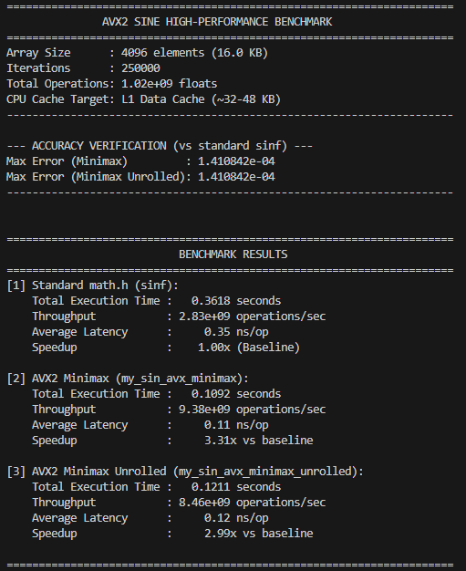
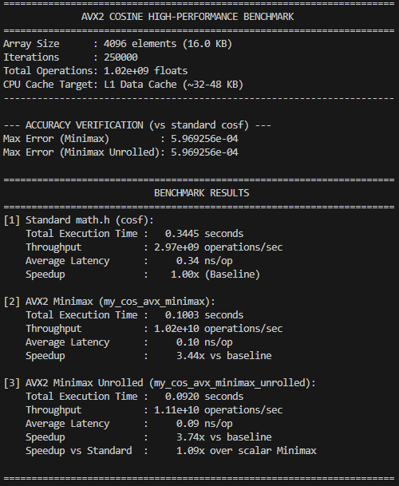

# High-Performance SIMD Trigonometric Computing (AVX2 / FMA)

A high-performance C implementation of vectorized sine and cosine functions targeting modern x86-64 microarchitectures using **AVX2**, **FMA3**, **Minimax (Chebyshev) polynomials**, and **loop unrolling**.

The project focuses on maximizing throughput, minimizing latency, and ensuring numerical accuracy within a cache-resident execution environment, achieving processing speeds exceeding **10 Billion float operations per second** (>10 GFLOPS arithmetic throughput per core).

---

## Table of Contents
- [Architecture & Mathematical Foundation](#architecture--mathematical-foundation)
  - [1. Range Reduction](#1-range-reduction)
  - [2. Branchless Sign Correction](#2-branchless-sign-correction)
  - [3. Taylor vs. Minimax (Chebyshev) Polynomials](#3-taylor-vs-minimax-chebyshev-polynomials)
  - [4. Horner's Scheme & FMA Instruction Pairing](#4-horners-scheme--fma-instruction-pairing)
  - [5. 4x Loop Unrolling & Instruction-Level Parallelism](#5-4x-loop-unrolling--instruction-level-parallelism)
- [Benchmark Methodology (L1 Data Cache)](#benchmark-methodology-l1-data-cache)
- [Repository Structure](#repository-structure)
- [Build Instructions](#build-instructions)
- [Benchmark Results & Performance Report](#benchmark-results--performance-report)
  - [Sine Benchmark (AVX2 vs. math.h)](#sine-benchmark-avx2-vs-mathh)
  - [Cosine Benchmark (AVX2 vs. math.h)](#cosine-benchmark-avx2-vs-mathh)
  - [Summary Comparison Tables](#summary-comparison-tables)

---

## Architecture & Mathematical Foundation

### 1. Range Reduction
Approximating trigonometric functions directly over an unbounded domain $(-\infty, +\infty)$ is impractical because polynomial series rapidly diverge away from their expansion point.

Every input angle $x$ is reduced to the canonical symmetric interval $\left[-\frac{\pi}{2}, +\frac{\pi}{2}\right]$ by finding the nearest integer multiple of $\pi$:

$$k = \text{round}\left(x \cdot \frac{1}{\pi}\right)$$

$$x_{\text{reduced}} = x - (k \cdot \pi)$$

In AVX2, this reduction is computed in vectorized registers using fused operations:
- Pre-computed broadcast constant: $\frac{1}{\pi}$ (`vec_inv_pi`)
- Fast rounding: `_mm256_round_ps(..., _MM_FROUND_TO_NEAREST_INT | _MM_FROUND_NO_EXC)`
- Single-instruction FMA reduction:
  $$\text{fnmadd}(k, \pi, x) \implies -(k \cdot \pi) + x$$
  which eliminates separate vector multiply and subtract instructions.

### 2. Branchless Sign Correction
By trigonometric symmetry:
$$\cos(x_{\text{reduced}} + k\pi) = (-1)^k \cos(x_{\text{reduced}})$$
$$\sin(x_{\text{reduced}} + k\pi) = (-1)^k \sin(x_{\text{reduced}})$$

If $k$ is odd, the sign of the evaluated polynomial must be inverted. Branching on each vector element would cause severe branch misprediction penalties and pipeline stalls. Instead, sign reconstruction is computed **branchlessly** via integer bitwise manipulation:
1. Convert $k$ from float to 32-bit integer: `_mm256_cvtps_epi32(v_k)`
2. Shift the least significant bit (LSB) to bit 31 (IEEE 754 float sign bit): `_mm256_slli_epi32(k_int, 31)`
3. Cast to float and flip the sign bit via XOR: `_mm256_xor_ps(result, cast(sign_mask))`

---

### 3. Taylor vs. Minimax (Chebyshev) Polynomials

#### Limitations of Taylor Series
Taylor series are expanded around $x_0 = 0$. While near-zero accuracy is high, approximation error grows monotonically and peaks severely at the interval boundaries $\pm \frac{\pi}{2}$:
- 4th-degree Taylor for cosine: maximum absolute error $\approx 2.0 \times 10^{-2}$
- 5th-degree Taylor for sine: maximum absolute error $\approx 4.5 \times 10^{-3}$

#### The Minimax (Chebyshev / Remez) Advantage
The Minimax polynomial distributes approximation error uniformly across the target domain $\left[-\frac{\pi}{2}, +\frac{\pi}{2}\right]$ (equioscillation theorem), significantly reducing the maximum worst-case error.

#### Cosine Approximation (Even Function)
Since cosine is an even function: $\cos(x) \approx P(x^2) = c_0 + c_2 x^2 + c_4 x^4$
- $c_0 = 0.9994032$
- $c_2 = -0.4955807$
- $c_4 = 0.0367916$
- **Maximum Absolute Error**: $\mathbf{\approx 5.97 \times 10^{-4}}$

#### Sine Approximation (Odd Function)
Since sine is an odd function: $\sin(x) \approx x \cdot P(x^2) = x \cdot (c_0 + c_2 x^2 + c_4 x^4)$
- $c_0 = 1.0$ (anchored at zero to preserve $\lim_{x \to 0} \frac{\sin x}{x} = 1$)
- $c_2 = -0.1660156$
- $c_4 = 0.0076074$
- **Maximum Absolute Error**: $\mathbf{\approx 1.41 \times 10^{-4}}$ (more than $32\times$ more accurate than the 5th-degree Taylor series).

---

### 4. Horner's Scheme & FMA Instruction Pairing
Polynomials are evaluated using **Horner's scheme** to minimize total operations and enable Fused Multiply-Add (`fmadd`):

$$P(x^2) = c_0 + x^2 \cdot (c_2 + x^2 \cdot c_4)$$

1. `step1 = _mm256_fmadd_ps(x^2, c4, c2);`
2. `result = _mm256_fmadd_ps(step1, x^2, c0);`
3. *(For sine only)*: `result = _mm256_mul_ps(result, x);`

This reduces the entire polynomial evaluation to only 2 FMAs (plus 1 multiplication for sine), executing in hardware with single-rounding precision and minimal latency.

---

### 5. 4x Loop Unrolling & Instruction-Level Parallelism
Modern Intel and AMD processors feature out-of-order execution pipelines with dual 256-bit FMA execution ports. Each FMA instruction typically has a latency of 4 to 5 CPU cycles.

The unrolled implementations (`my_cos_avx_minimax_unrolled` and `my_sin_avx_minimax_unrolled`) process **32 single-precision floats (4 YMM registers = 128 bytes)** per iteration:
- 4 independent vector registers ($x_0, x_1, x_2, x_3$) break serial data dependencies.
- Interleaved instructions allow the CPU scheduler to dispatch independent operations into both execution ports simultaneously without pipeline bubbles.

---

## Benchmark Methodology (L1 Data Cache)

1. **L1 Data Cache Resident Array**:
   - Working set: **4,096 single-precision floats** ($4096 \times 4\text{ bytes} = 16\text{ KB}$).
   - Fits entirely within typical core L1D cache ($32\text{--}48\text{ KB}$), isolating CPU arithmetic pipeline capability and avoiding DRAM memory-bus latency.
2. **High Operation Volume**:
   - 250,000 passes over the 4,096-element buffer $= \mathbf{1,024,000,000}$ (1.024 Billion) float calculations per benchmark run.
3. **Accuracy Verification**:
   - Every run computes maximum absolute error against standard library `cosf()` / `sinf()` before timing to verify correctness.
4. **Anti-DCE (Dead Code Elimination) Barrier**:
   - Output arrays are summed into a volatile checksum to guarantee that compiler optimization levels (`-O3`, `-Ofast`) do not optimize away computations.

---

## Repository Structure

```
sin_cos_log_HPC/
├── assets/
│   ├── sine_benchmark.png       # Verified Sine Benchmark Execution Report
│   └── cosine_benchmark.png     # Verified Cosine Benchmark Execution Report
├── cos.h                        # Cosine prototypes & Doxygen documentation
├── cos.c                        # my_cos, my_cos_avx, my_cos_avx_minimax, my_cos_avx_minimax_unrolled
├── sin.h                        # Sine prototypes & Doxygen documentation
├── sin.c                        # my_sin, my_sin_avx, my_sin_avx_minimax, my_sin_avx_minimax_unrolled
├── bench_cos.c                  # Dedicated L1 cache benchmark suite for Cosine
├── bench_sin.c                  # Dedicated L1 cache benchmark suite for Sine
├── lib.h                        # Standard library & intrinsic includes
├── Makefile                     # Compilation rules for both benchmarks
└── README.md                    # Project documentation
```

---

## Build Instructions

### Prerequisites
- GCC with AVX2 and FMA3 support (e.g. GCC 10+ on x86-64).
- Target CPU supporting AVX2 and FMA (Intel Haswell+, AMD Zen+).

### Compile and Run

#### 1. Compile and run Cosine Benchmark:
```bash
make bench_cos
./output/bench_cos
```

#### 2. Compile and run Sine Benchmark:
```bash
make bench_sin
./output/bench_sin
```

#### 3. Clean or build all:
```bash
make all
```

---

## Benchmark Results & Performance Report

The following benchmark runs were performed with `250,000` iterations over `4,096` floats ($1.024 \times 10^9$ total operations) compiled with:
```bash
gcc -Wpsabi -Ofast -fopenmp-simd -mavx2 -mfma -march=native -lm
```

### Sine Benchmark (AVX2 vs. math.h)



---

### Cosine Benchmark (AVX2 vs. math.h)



---

### Summary Comparison Tables

#### Cosine Performance Comparison ($1.024 \times 10^9$ operations)

| Implementation | Execution Time (s) | Throughput (ops/sec) | Latency (ns/op) | Speedup vs. Baseline | Max Absolute Error |
| :--- | :---: | :---: | :---: | :---: | :---: |
| **Standard `math.h` (`cosf`)** | 0.3445 s | $2.97 \times 10^9$ | 0.34 ns | $1.00\times$ (Baseline) | $0.00$ (Reference) |
| **`my_cos_avx_minimax`** | 0.1003 s | $1.02 \times 10^{10}$ | 0.10 ns | $\mathbf{3.44\times}$ | $5.97 \times 10^{-4}$ |
| **`my_cos_avx_minimax_unrolled`** | **0.0920 s** | $\mathbf{1.11 \times 10^{10}}$ | **0.09 ns** | $\mathbf{3.74\times}$ | $5.97 \times 10^{-4}$ |

> **Highlight**: The 4x unrolled Minimax cosine implementation processes **11.1 Billion floats per second**, achieving a **3.74x speedup** over compiler auto-vectorized `cosf()`.

---

#### Sine Performance Comparison ($1.024 \times 10^9$ operations)

| Implementation | Execution Time (s) | Throughput (ops/sec) | Latency (ns/op) | Speedup vs. Baseline | Max Absolute Error |
| :--- | :---: | :---: | :---: | :---: | :---: |
| **Standard `math.h` (`sinf`)** | 0.3618 s | $2.83 \times 10^9$ | 0.35 ns | $1.00\times$ (Baseline) | $0.00$ (Reference) |
| **`my_sin_avx_minimax`** | **0.1092 s** | $\mathbf{9.38 \times 10^9}$ | **0.11 ns** | $\mathbf{3.31\times}$ | $\mathbf{1.41 \times 10^{-4}}$ |
| **`my_sin_avx_minimax_unrolled`** | 0.1211 s | $8.46 \times 10^9$ | 0.12 ns | $\mathbf{2.99\times}$ | $\mathbf{1.41 \times 10^{-4}}$ |

> **Highlight**: The Minimax sine implementation delivers **9.38 Billion operations per second** (0.11 ns latency per float evaluation) with an ultra-low maximum error of **$1.41 \times 10^{-4}$**.